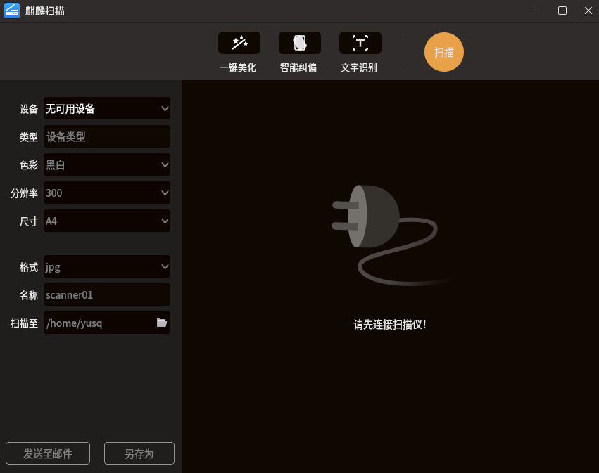

# kylin-scanner
Kylin Scanner is an interface-friendly scanning software developed with Qt5.
The software can scan according to the resolution, size and color mode of
the scanning device itself. At the same time, It Increases post-processing of scanned pictures,
including one-click beautification, intelligent correction and text recognition.
Other image processing tips can also be reflected in this software, such as clipping, rotation, etc.



## Author's Home page
:point_right:  [Franklin-Qi](https://Franklin-Qi.github.io/)

## Function lists
- [x] Normal scanning(different device, type, resolution, size, color mode, formats)
- [x] One-clicked beautification
- [x] Intelligent correction
- [x] text recognition OCR
- [x] Image processing: clipping, rotation, watermarking, symmetry, etc
- [x] Send email
- [x] Save as multi-formats contents

## How to build and install in Ubuntu Environments
1. Build and Install via **debuild**
``` bash
# Git clone
$ git clone https://github.com/ubuntukylin/kylin-scanner.git

# Go to root dir /kylin-scanner/ and build
$ cd kylin-scanner/

# build
$ debuild

# Use dpkg to install
# kylin-scanner_1.0.0_amd64.deb is generated by debuild
$ sudo dpkg -i ../kylin-scanner_1.0.0_amd64.deb
$ sudo apt install -f # Handle depents, while it's the first install
$ sudo dpkg -i ../kylin-scanner_1.0.0_amd64.deb

# Enjoy it
$ kylin-scanner
or
open and search "kylin scanner" after enter Win key
```

2. Build and Install via **qmake**
``` bash
# Git clone
$ git clone https://github.com/ubuntukylin/kylin-scanner.git

# Go to root dir /kylin-scanner/
$ cd kylin-scanner/

# build
$ qmake
$ make

# install
$ sudo make install

```

## How to make helpful docs
```
$ doxygen -g
$ ./autodoxygen.sh
$ doxygen Doxygen
$ firefox docs/html/index.html
```

## Report bugs
Bugs should be report to the kylin-scanner bug tracking system: https://github.com/ubuntukylin/kylin-scanner
