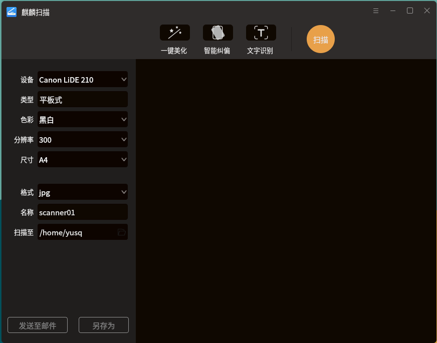

# kylin-scanner
麒麟扫描软件是一款用Qt开发的界面友好的扫描软件。该软件可以根据扫描设备本身的分辨率、尺寸和色彩模式进行扫描，
同时增加了对扫描图片的后期处理（包括一键美化、智能纠偏和文字识别三大功能）。其他的一些图像处理小技巧也可以在此软件
上体现，如裁切、旋转等。



## 作者博客页面
:point_right:  [Franklin-Qi](https://Franklin-Qi.github.io/)

## 功能列表
- [x] 正常扫描（根据不同的设备类型，分辨率，尺寸，色彩模式，保存格式）
- [x] 一键美化：HDR色调，锐化等
- [x] 智能纠偏
- [x] 文字识别
- [x] 图片后期处理：裁切，旋转，水印，对称翻转
- [x] 发送邮件
- [x] 另存为不同格式的内容

## Ubuntu 环境配置
``` bash
# opencv essential
sudo apt install libopencv-dev

# sane essential
sudo apt sane sane-utils xsane libsane-dev libsane

# OCR essential
sudo apt install tesseract-ocr tesseract-ocr-eng tesseract-ocr-chi-sim libleptonica-dev libtesseract-dev

# For gio-unix-2.0
sudo apt install libglib2.0-dev
```

## 生成帮助文档
```
$ doxygen -g
$ ./autodoxygen.sh
$ doxygen Doxygen
$ firefox docs/html/index.html
```

## 反馈问题
问题可以通过kylin-scanner 问题热点进行反馈：https://github.com/yusq77/kylin-scanner

